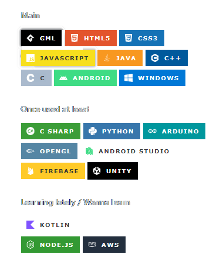

<div align = "right">
  
##
<!-- 방문자 수 표기 -->
[](https://hits.seeyoufarm.com)

</div>

<!-- 페코린느 -->
<a href="https://aber1047.github.io/MyPortfolio/"></a>


### 👋안녕하세요! Hello! こんにちは!

> <b> I'm student developer who make something fun!
> 
> You can see the main projects in <a href="https://aber1047.github.io/MyPortfolio/">"About Me"</a>
> 
> ```All projects without special description are solo developed``` </b>
> 
> 
> <!-- 유튜브, aboutme, 디스코드 링크 버튼 -->
> <a href="https://aber1047.github.io/MyPortfolio/"></a> 
> <a href = "https://discord.gg/TcG38dPRjM"></a> 
> <a href = "https://steamcommunity.com/id/324tyAQASDG/"></a>

<div align = "center">

```Language : kr-KR / jp-JP / en-US```
<!-- <a href = "https://www.youtube.com/channel/UCuBkudnNQFlTt6QQ-9Nhdtw"></a> -->

<!--  ##  -->

<!--  spotify 상태 표시  -->
<!--  [](https://youtu.be/uHw4kUaFRZ0)  -->
  
<!--  -->

</div>
<!-- </br> -->


##


<ul>


  
  
  


<div align = "center">


<!--  -->


#### etc


<a href = "https://g.co/kgs/u8bhbD">

</a>
<a href = "https://g.co/kgs/yfFQER">

</a></br>
<a href = "https://www.aseprite.org/">

</a>
<a href = "https://g.co/kgs/k79t41">

</a>


##### Learning lately / Wanna learn

<a href = "https://g.co/kgs/hwQdvi">

</a> 


<a href = "https://g.co/kgs/pZkEqS">


</ul>

</div>

<div align = "center">
  
##


<!--  트로피  -->
[](https://github.com/ABER1047/github-profile-trophy)
  
</div>


##

<div align = "center">


[](https://solved.ac/aber1047/)
  
  

</div>


