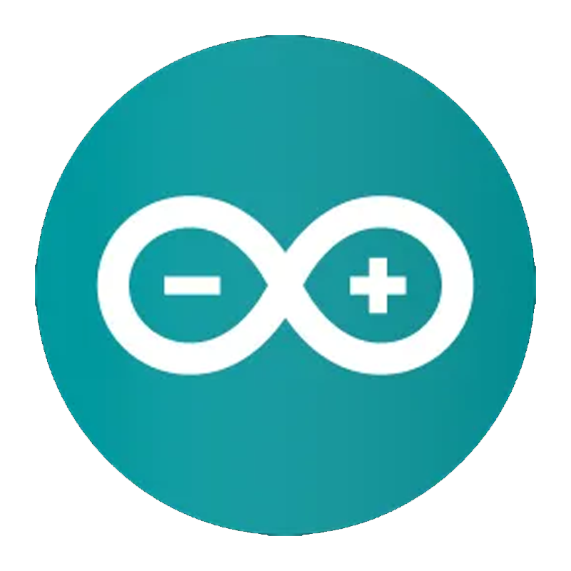

<div align = "right">
  
##
<!-- 방문자 수 표기 -->
[](https://hits.seeyoufarm.com)

</div>

<!-- 페코린느 -->
<a href = "https://aber1047.github.io/MyPortfolio/"></a>


### 👋안녕하세요! Hello! こんにちは!

> <b> I'm student developer who make something fun!
> 
> You can see the main projects in <a href="https://aber1047.github.io/MyPortfolio/">"About Me"</a>
> 
> ```All projects without special description are solo developed``` </b>
> 
> 
> <!-- 유튜브, aboutme, 디스코드 링크 버튼 -->
> <a href="https://aber1047.github.io/MyPortfolio/"></a> 
> <a href = "https://discord.gg/TcG38dPRjM"></a> 
> <a href = "https://steamcommunity.com/id/324tyAQASDG/"></a>
> 
> <div align = "center">
> 
> ```Language : kr-KR / jp-JP / en-US```
<!-- <a href = "https://www.youtube.com/channel/UCuBkudnNQFlTt6QQ-9Nhdtw"></a> -->

<!--  ##  -->

<!--  spotify 상태 표시  -->
<!--  [](https://youtu.be/uHw4kUaFRZ0)  -->
  
<!--  -->

</div>
<!-- </br> -->


##

<div align = "center">
  
|<div align = "center">  </div>|<div align = "left">      Main</br>      <code><a href = "https://en.wikipedia.org/wiki/GameMaker"></a></code>      <code><a href = "https://en.wikipedia.org/wiki/JavaScript"></a></code>      <code><a href = "https://en.wikipedia.org/wiki/HTML"></a></code>       <code><a href = "https://en.wikipedia.org/wiki/CSS"></a></code>       <code><a href = "https://en.wikipedia.org/wiki/Java_(programming_language)"></a></code>     <code><a href = "https://en.wikipedia.org/wiki/C_(programming_language)"></a></code>       <code><a href = "https://en.wikipedia.org/wiki/C%2B%2B"></a></code>      <code><a href = "https://en.wikipedia.org/wiki/https://en.wikipedia.org/wiki/Android_(operating_system)"></a></code>     <code><a href = "https://en.wikipedia.org/wiki/Microsoft_Windows"></a></code>     </br></br>Sub</br>      <code><a href = "https://en.wikipedia.org/wiki/Python_(programming_language)"></a></code>       <code><a href = "https://en.wikipedia.org/wiki/Android_Studio"></a></code>       <code><a href = "https://en.wikipedia.org/wiki/Arduino"></a></code>    <code><a href = "https://en.wikipedia.org/wiki/Unity_(game_engine)"></a></code>     </br></br>Etc.</br>    <code><a href = "https://en.wikipedia.org/wiki/Adobe_Photoshop"></a></code>   <code><a href = "https://en.wikipedia.org/wiki/Adobe_After_Effects"></a></code>      <code><a href = "https://en.wikipedia.org/wiki/Clip_Studio_Paint"></a></code>   <code><a href = "https://en.wikipedia.org/wiki/Aseprite"></a></code></div>|
|--|--|

</div>


<div align = "center">
  
##

<!--  -->

<!--  트로피  -->
[](https://github.com/ABER1047/github-profile-trophy)
  
</div>


##

<div align = "center">


[](https://solved.ac/aber1047/)
  
  

</div>


