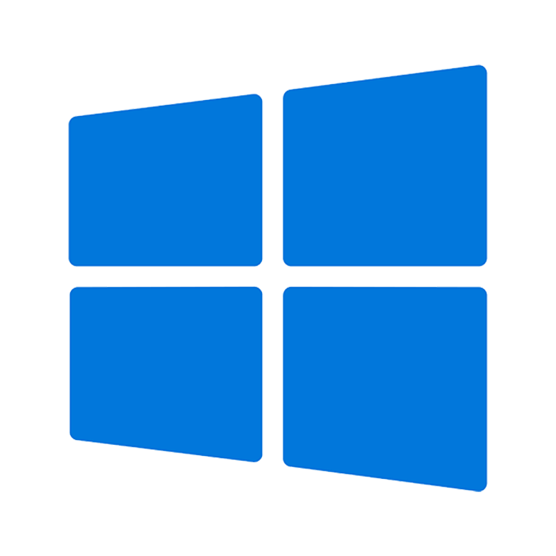

<div align = "right">
  


<!-- 방문자 수 표기 -->
<!-- [](https://hits.seeyoufarm.com) -->

</div>

<!-- 페코린느 -->
<a href = "https://aber1047.github.io/MyPortfolio/"></a>


### 👋안녕하세요! Hello! こんにちは!

> <b> I'm student developer who make something fun!
> 
> You can see the main projects in <a href="https://aber1047.github.io/MyPortfolio/">"About Me"</a>
> 
> ```All projects without special description are solo developed``` </b>
> 
> 
> <!-- 유튜브, aboutme, 디스코드 링크 버튼 -->
> <a href="https://aber1047.github.io/MyPortfolio/"></a> 
> <a href = "https://discord.gg/TcG38dPRjM"></a> 
> <a href = "https://steamcommunity.com/id/324tyAQASDG/"></a>
> 
> <div align = "center">
> 


</br>
<div align = "center">


|<div align = "center">  </div>|<div align = "left">      Main</br>      <code><a href = "https://en.wikipedia.org/wiki/GameMaker"></a></code>      <code><a href = "https://en.wikipedia.org/wiki/JavaScript"></a></code>      <code><a href = "https://en.wikipedia.org/wiki/HTML"></a></code>       <code><a href = "https://en.wikipedia.org/wiki/CSS"></a></code>       <code><a href = "https://en.wikipedia.org/wiki/Java_(programming_language)"></a></code>     <code><a href = "https://en.wikipedia.org/wiki/C_(programming_language)"></a></code>       <code><a href = "https://en.wikipedia.org/wiki/C%2B%2B"></a></code>      <code><a href = "https://en.wikipedia.org/wiki/https://en.wikipedia.org/wiki/Android_(operating_system)"></a></code>     <code><a href = "https://en.wikipedia.org/wiki/Microsoft_Windows"></a></code>     </br></br>Sub</br>      <code><a href = "https://en.wikipedia.org/wiki/Python_(programming_language)"></a></code>       <code><a href = "https://en.wikipedia.org/wiki/Android_Studio"></a></code>       <code><a href = "https://en.wikipedia.org/wiki/Arduino"></a></code>    <code><a href = "https://en.wikipedia.org/wiki/Unity_(game_engine)"></a></code>       <code><a href = "https://en.wikipedia.org/wiki/C_Sharp_(programming_language)"></a></code>     </br></br>Etc.</br>     <code><a href = "https://en.wikipedia.org/wiki/Adobe_Photoshop"></a></code>   <code><a href = "https://en.wikipedia.org/wiki/Adobe_After_Effects"></a></code>      <code><a href = "https://en.wikipedia.org/wiki/Clip_Studio_Paint"></a></code>   <code><a href = "https://en.wikipedia.org/wiki/Aseprite"></a></code>      </br></br>Learning</br>     <code><a href = "https://en.wikipedia.org/wiki/SQL"></a></code>         <code><a href = "https://en.wikipedia.org/wiki/Blender_(software)"></a></code>      <code><a href = "https://en.wikipedia.org/wiki/FL_Studio"></a></code>        <code><a href = "https://en.wikipedia.org/wiki/Kotlin_(programming_language)"></a></code>      </div>|
|--|--|


</div>


</div>
<!-- </br> -->

## </img> About me

* #### </img> Hello!
  * ###### I'm a person who is living in South Korea
  * ###### Currently in 2nd year of computer software engineering
  * ###### I like everything related to games and that's why I am learning drawings and music making to make my indie games
  * ###### And also I'm interested in everything related to computers that's why I've learned programing and etc.

</br>

* #### 🌐Lang
  * ###### Kr, Jp, Eng (I've learned Japanese through my Japanese friends, books and still learning now)

</br>

* #### </img> Solved.ac [S4]
  * ###### Currently learning various algorithms with solving some problems
 
</br>

<details>
  <summary><b></img> Stats [Click to expand)</b></summary>

  | [](https://github.com/ABER1047/github-profile-trophy) |  | [](https://solved.ac/aber1047/) |
  |--|--|--|
  
</details>


##


